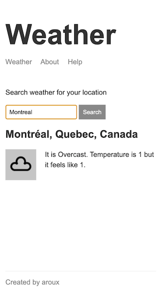

# Search weather Express app

Basic Express app to fetch geolocation and weather forecast. Live demo [here](https://aroux-express-weather.herokuapp.com/).

Using [Mapbox](https://www.mapbox.com/) and [WeatherStack](https://weatherstack.com/) APIs (update `.env` file with personal APIs keys)



## Dependencies and tools

```
npm install
```

- Nodemon `npm run dev`
- Node & Express
- Handlebars
